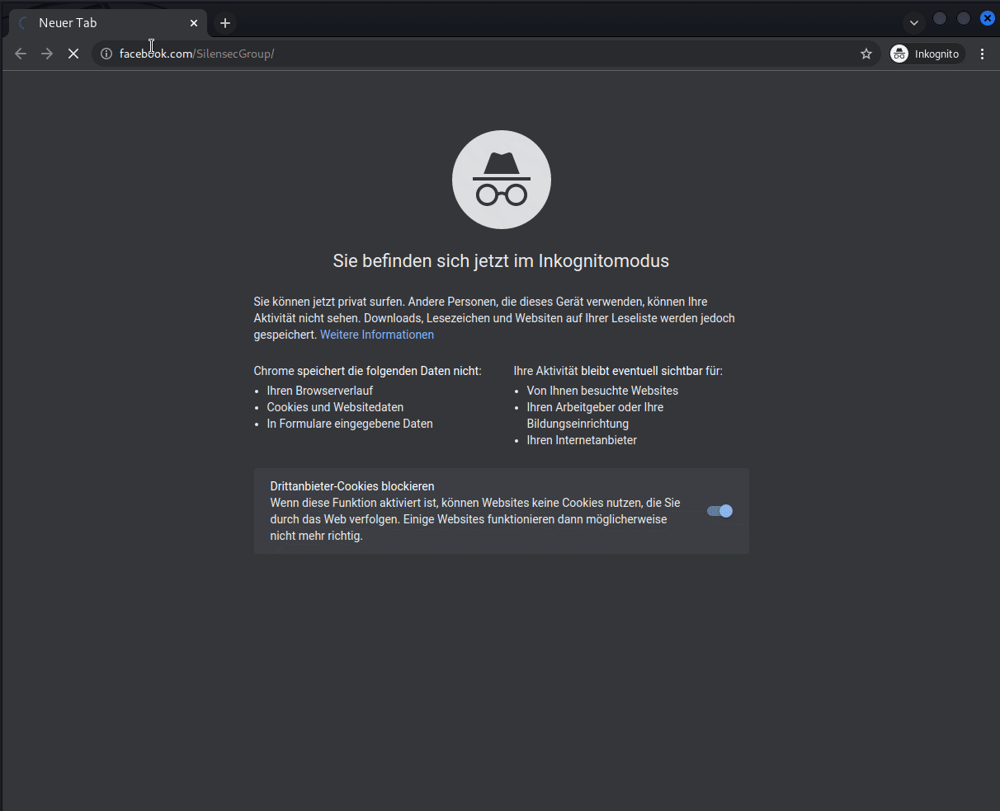
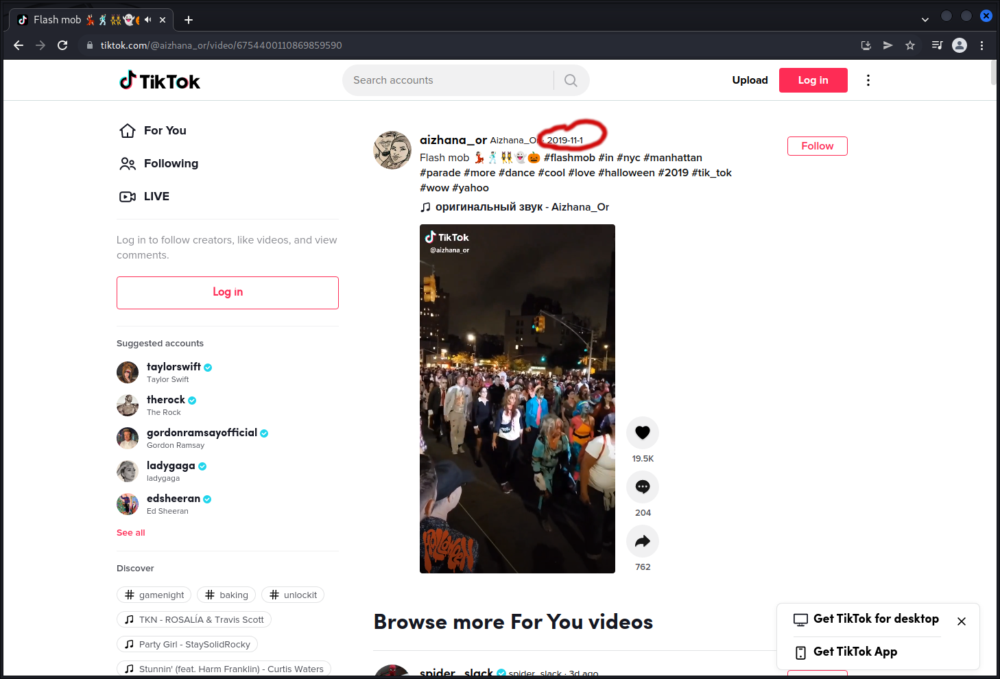
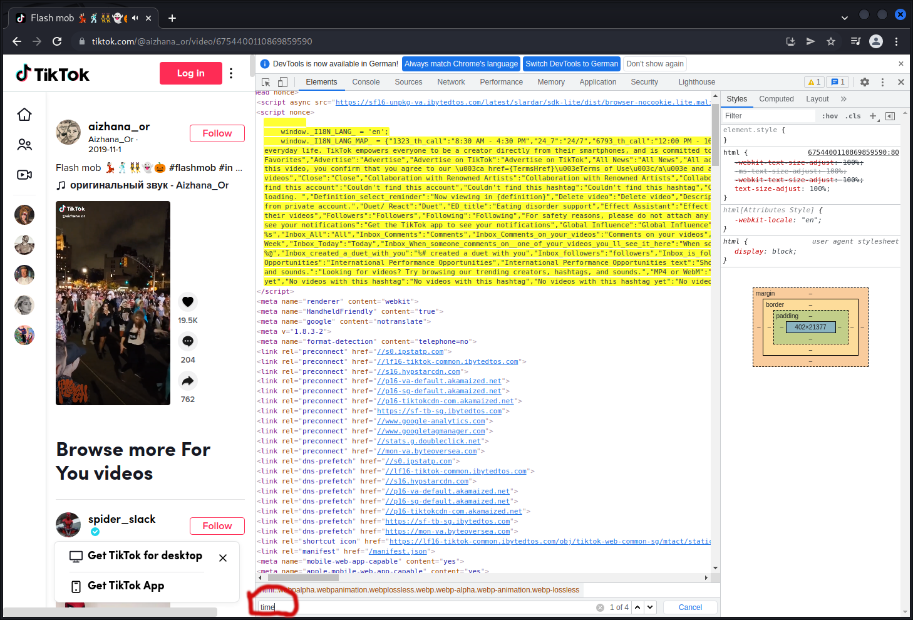
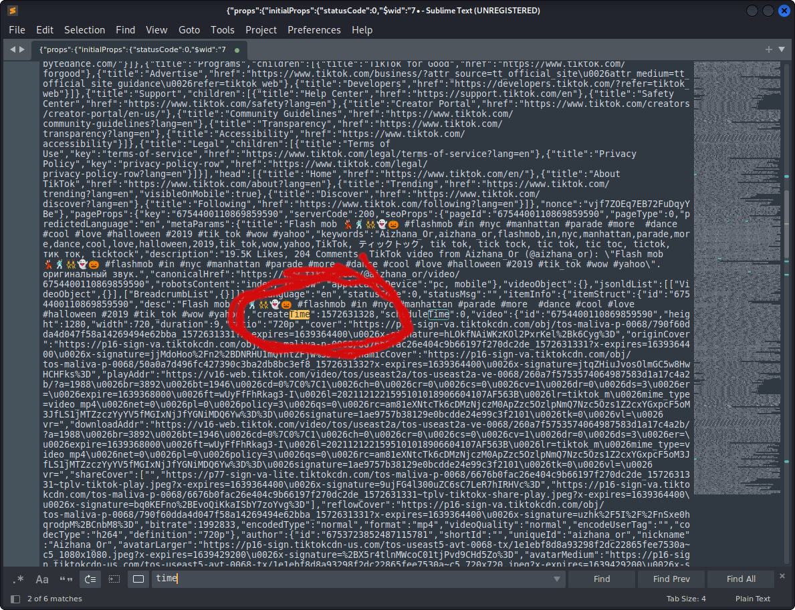

## Sector035's OSINT quiz

The [osint quiz](https://twitter.com/Sector035/status/1211038518635614208) of
[𝕊𝕖𝕔𝕥𝕠𝕣𝟘𝟛𝟝](https://twitter.com/Sector035) and the [Quiztime](https://twitter.com/Quiztime) crew is probably the 
challenge you read most about (at least combined with OSINT).

--------------------------
### Challenge 0 - Start
As told in the referenced tweet above you start this quiz by sending an email to osintquiz@gmail.com
with the subject "start".

After sending this initial email you will receive a short introduction on how the ctf works and which subjects will 
be covered:
> - Geolocation (determining locations)
> - SIGINT (from 3G/LTE to WiFi)
> - Social media (anything goes!)
> - News articles (from any country)
> - Surface web & dark web (no worries, we'll stay legal!)
> - Metadata in files (a bit of basic forensics can't hurt right?)
> - Tracking traffic or objects (start looking up some URL's!)
> - Maybe more...

--------------------------
### Challenge 1
> Create the MD5 hash of the word "puzzletweet"

#### What is MD5?
>The MD5 (message-digest algorithm) hashing algorithm is a one-way cryptographic function that accepts a message of any length as input and returns as output a fixed-length digest value to be used for authenticating the original message.
> -- <cite>[TechTarget](https://www.techtarget.com/searchsecurity/definition/MD5) </cite>


Of course the md5 hash can be calculated using the command line command "md5sum":
````commandline
echo -n "puzzletweet" | md5sum
````
Keep in mind the -n option removes the newline after the echo output as you dont want the
newline character to be part of the plaintext string.

As I want to expand my python skills, I'll be trying to solve as many challenges as possible also in python:
````python
import hashlib

plaintext = "puzzletweet"
encoded_text = hashlib.md5(plaintext.encode())

print("The md5 of " + plaintext + " is: " + str(encoded_text.hexdigest()))
````
Pythonfile: 
[challenge001.py](https://github.com/road2OSINTautomation/ctfs/blob/main/src/sector035_osintquiz/challenge001.py)

--------------------------

### Challenge 2
> In December 2017 @Sector035 posted a photo of a puzzle. What is the ID of the photo? 
> That is the highlighted part in this URL

Wow, this challenge seemed to be so easy to implement in python. <br/>
Twitter has really well documented API and also there are quite a couple of python modules already
implementing the api. <br />
Unfortunately you can not search twitter data longer than 7 days old with the free API.

Doing it manually seems so straight forward. Just head to the twitter 
[advance search](https://twitter.com/search-advanced?lang=en) type in @Sector035 as username and add the from and to 
dates at the bottom of the form. <br />
After that you can click on Photos and you will only see 6 different posts and can easily find the photo 
of a puzzle.
First click on the photo and then right click to and view the photo in a new tab...Now you can copy the needed part of 
the url and create your md5 :)

Anyway my goal is to solve these challenges in a pythonic way:

Also I definitely was getting frustrated to not be able to do this simple manual call with the 
free Twitter API, I randomly clicked through my twitter developer dashboard and found the "Premium"-section.
You can find it via Dashboard -> Products (on the left) -> Premium.
After setting up a "Dev Environment" you can use the "Search Tweets API: Full Archive"-API.

And voila this is exactly what I was after!!!
You can find the documentation including a curl example here:
https://developer.twitter.com/en/docs/twitter-api/premium/search-api/quick-start/premium-full-archive

I used the example to code the python request. After filtering on tweets including the word 'puzzle' 
you can get the tweet_id of the tweet including the photo of the puzzle.

Now you're still not quite finished as you need the photo_id. To help me get that id I used the 
example code of twitter for the 
["Tweet-Lookup"-API](https://github.com/twitterdev/Twitter-API-v2-sample-code/blob/main/Tweet-Lookup/get_tweets_with_bearer_token.py).

Putting it all together ended with [challenge002.py](https://github.com/road2OSINTautomation/ctfs/blob/main/src/sector035_osintquiz/challenge002.py)

#### Side notes on challenge 2
After finishing setting everything up I put my keys and secrets into an extra file "twitter_api.creds" in the following 
format:
````editorconfig
[DEFAULT]
consumer_key = XXXXXXXXXXXXXXXXXXXXXXXXX
consumer_secret = XXXXXXXXXXXXXXXXXXXXXXXXXXXXXXXXXXXXXXXXXXXXXXXXXX
access_token_key = XXXXXXXXXXXXXXXXXXXXXXXXXXXXXXXXXXXXXXXXXXXXXXXXXX
access_token_secret = XXXXXXXXXXXXXXXXXXXXXXXXXXXXXXXXXXXXXXXXXXXXX
bearer_token = XXXXXXXXXXXXXXXXXXXXXXXXXXXXXXXXXXXXXXXXXXXXXXXXXXXXXXXXXXXXXXXXXXXXXXXXXXXXXXXXXXXXXXXXXXXXXXXXXXXXXXXXXXXXXXXX
````
You will have to escape the percentage sign '%' within the bearer_token by replacing the single '%' with 
two of them => '%%'.

It may seem as a little bit of a hassle but if you stick to the guide and applying for an "Elevated" Account straight 
after you should be done in less than 10 minutes. I missed creating the elevated Account first and got a warning that I 
am not allowed to use the full api when verifying my developer account with python-twitter
````python
 print(api.VerifyCredentials())
````
BTW: If you ever need a twitter user's id either look in the source code of the following button or just 
use this javascript snippet:
There are plenty of online tools but most of the time it is useful to at least 
know what and how exactly third party tools work.
````javascript
alert(document.querySelector('div[data-testid="placementTracking"] div[data-testid]').dataset.testid.split('-')[0])
````

#### Summary
Wow this straight forward challenge really got me digging into the twitter API. Great opportunity 
which I otherwhise would probably not have done so soon!
<br />

### Anyway....


### ...forget about that
<br/>

#### A much better solution
After asking for any other existing Python Twitter-Libraries on reddit I got TWINT recommended.

Now...all that messing around whether finding out how to use the older and the newer Twitter API or 
setting up the developer account would have not been necessary.
TWINT did the whole challenge 2 in just 17 lines of code.
[challenge002_twint.py](https://github.com/road2OSINTautomation/ctfs/blob/main/src/sector035_osintquiz/challenge002_twint.py)
```python
import hashlib
import twint

c = twint.Config()
c.Search = "puzzle"
c.Username = "sector035"
c.Since = "2017-12-01"
c.Until = "2017-12-31"
c.Images = True
c.Pandas = True

tweet = twint.run.Search(c)
Tweets_df = twint.storage.panda.Tweets_df
photo_url = Tweets_df['photos'].to_string(index=False).replace('[','').replace(']','')
photo_id = ".".join(photo_url.split('/media/')[-1].split('.')[0:-1])
hash_object = hashlib.md5(photo_id.encode()).hexdigest()
print(hash_object)
```
<p align="center">

</p>

-----------------------------------

### Challenge 3

> What is the profile id of the following Instagram account? <br />
> https://www.instagram.com/micro_bar

Using Instagram's internal api "instagram.com/web/search/" easily gives you the results for a search 
as JSON back.
Parsing the result and looking for the specific username will give you the "pk" attribute.
```json
{"position":1,"user":{"pk":"2260998159","username":"micro_bar","full_name":"#MicroBar #Reykjavík #Iceland","is_private":false,"profile_pic_url":"https://instagram.fman4-1.fna.fbcdn.net/v/t51.2885-19/s150x150/12144329_1248859285130119_1067992394_a.jpg?_nc_ht=instagram.fman4-1.fna.fbcdn.net\u0026_nc_cat=107\u0026_nc_ohc=BCtTkekmQ_0AX-hRWOy\u0026edm=AHG7ALcBAAAA\u0026ccb=7-4\u0026oh=d9471bb0b6d6577cdab72e2c3d4fad33\u0026oe=61BB2E62\u0026_nc_sid=5cbaad","is_verified":false,"follow_friction_type":-1,"has_anonymous_profile_picture":false,"has_highlight_reels":false,"account_badges":[],"latest_reel_media":0,"live_broadcast_id":null,"should_show_category":false}}
```

Putting it all together receives in:
[challenge003.py](https://github.com/road2OSINTautomation/ctfs/blob/main/src/sector035_osintquiz/challenge003.py)
```python
import requests
username = "micro_bar"
url = "https://www.instagram.com/web/search/topsearch/?context=blended&query=" + username
response = requests.get(url)
response_json = response.json()

for entry in response_json["users"]:
    if entry["user"]["username"] == username:
        print(entry["user"]["pk"])
```


Instagram seems to block you pretty quickly and in response will want you to log in (even if the profile is public).
For that try using a vpn, different browser/private browser or wait a couple of minutes.
For me the only thing that did the trick was to wait roughly around 5 minutes.


-----------------------------------

### Challenge 4
> What is the MD5 hash of following Facebook ID: <br />
> https://www.facebook.com/SilensecGroup

I decided to do this challenge using requests as the profile is public and un less you 
do too many requests after each other you will be able to visit the page without having to login.

[challenge004.py](https://github.com/road2OSINTautomation/ctfs/blob/main/src/sector035_osintquiz/challenge004.py)

```python
import requests

user_agent = "Mozilla/5.0 (Windows NT 10.0; Win64; x64) AppleWebKit/537.36 (KHTML, like Gecko) Chrome/92.0.4476.0 " \
             "Safari/537.36 "
HEADERS = ({'User-Agent': user_agent,
            'Accept-Language': 'en-US, en;q=0.8'})

profile_url = "https://www.facebook.com/SilensecGroup"
response = requests.get(profile_url, headers=HEADERS)
response_string = str(response.content)

profile_id = response_string.split('entity_id":"')[1].split('"}')[0]
print("Facebook profile:\t" + profile_url)
print("ID:\t\t\t\t\t" + profile_id)
``` 
I would have preferred to parse the html with beautifulsoup or lxml and get the profile picture by the element 
with the attribute "arial-label" having the value "Profile picture".

<br />

#### The manual way
 After 
  
Doing it manually my favorite way is inspecting the profile picture and getting the id from the picture url:
> <a <mark style="background-color: lightblue">aria-label="Profile picture"</mark> ... href="/<mark style="background-color: orange">403139539857741</mark>/photos/509205822584445/"></a>

But as Facebook doesnt pass the HTML seen in the inspector in the browser I didn't go for a xpath like <br />
`//*[@*='Profile picture']` which works just fine e.g. in Chrome when having English as the language.

Instead I found the "entitiy_id" key in the response which contains the user id: `"entity_id":"403139539857741"}`
So i just parsed that out using String split and voilà there is the wanted id :)

-----------------------------------

### Challenge 5

> At what timestamp was the following TikTok posted? This will be a 10-digit number in 'UNIX time', that can be 
> found in the source. <br />
> https://www.tiktok.com/@aizhana_or/video/6754400110869859590

So the first step was to see how one manually would find the exact timestamp. <br />
This was especially interesting as I have never used Tiktok before. Years ago I was on Facebook but decided to delete 
all that fake happy life stuff and sticked with twitter :)

Opening up the tiktok all we can see is 2019-11-1 as timestamp:



But what we need for the challenge is the exact UNIX timestamp.

What I like to do if I am looking for more information than what is displayed is open the 
developer tools and searching for keywords. <br />
Keep in mind that Firefox developer tools don't provide a CTRL+F function but Chrome does.

As we are looking for the upload timestamp I searched for keywords like
- upload
- date
- time
- create

It's a bit like bruteforcing simple CTF challenges. Before starting I often think 
"oh, this will never work" or "it'll be something I am not thinking about".
But similiar to those ctf challenge the timestamp we are looking for here, is easier to 
find as you might think.



As there are only 4 results for the keyword "time" copy them to your favorite texteditor
(I love sublime <3) and search them in there to find the context.



Now we can see the attribute we are looking for is not time but "createTime".
If you are doing this manually you could just create the md5sum of this UNIX timestamp 
and that is you finished the challenge.

As I want to do this using Python, I copied the code from challenge 4 because it seems pretty 
similiar to automate:
[challenge005.py](https://github.com/road2OSINTautomation/ctfs/blob/main/src/sector035_osintquiz/challenge005.py)


```python
import requests
import datetime

user_agent = "Mozilla/5.0 (Windows NT 10.0; Win64; x64) AppleWebKit/537.36 (KHTML, like Gecko) Chrome/92.0.4476.0 " \
             "Safari/537.36 "
HEADERS = ({'User-Agent': user_agent,
            'Accept-Language': 'en-US, en;q=0.8'})

tiktok_url = "https://www.tiktok.com/@aizhana_or/video/6754400110869859590"

response = requests.get(tiktok_url, headers=HEADERS)
response_string = str(response.content)
create_time = response_string.split('createTime":')[1].split(",")[0]

print("Tiktok url:\t\t\t\t\t\t\t" + tiktok_url)
print("CreateTime (UNIX Timestmap):\t\t" + create_time)
print("CreateTime (humanreadable):\t\t\t" +
      datetime.datetime.fromtimestamp(int(create_time)).strftime('%Y-%m-%d %H:%M:%S'))

```

All there was left to do was to change the split to extract the value of "createTime" and for a better readable 
output I converted the UNIX timestamp to a human-readable timestamp

-----------------------------------

### Challenge 6

> On what date was the domain facebook.com registered for the first time?

As there are many websites with nice graphical user interfaces for doing whois lookups I 
will use the python library whois.
To be able to run this little script on your computer you must make sure to install the right library
`pip install python-whois`.

Doing a whois-request using this library will return the same information as using a website for the request:
```json
{
  "domain_name": "FACEBOOK.COM",
  "registrar": "RegistrarSafe, LLC",
  "whois_server": "whois.registrarsafe.com",
  "referral_url": null,
  "updated_date": "2022-01-26 16:45:06",
  "creation_date": "1997-03-29 05:00:00",
  "expiration_date": "2031-03-30 04:00:00",
  "name_servers": [
    "A.NS.FACEBOOK.COM",
    "B.NS.FACEBOOK.COM",
    "C.NS.FACEBOOK.COM",
    "D.NS.FACEBOOK.COM"
  ],
  "status": [
    "clientDeleteProhibited https://icann.org/epp#clientDeleteProhibited",
    "clientTransferProhibited https://icann.org/epp#clientTransferProhibited",
    "clientUpdateProhibited https://icann.org/epp#clientUpdateProhibited",
    "serverDeleteProhibited https://icann.org/epp#serverDeleteProhibited",
    "serverTransferProhibited https://icann.org/epp#serverTransferProhibited",
    "serverUpdateProhibited https://icann.org/epp#serverUpdateProhibited",
    "serverUpdateProhibited https://www.icann.org/epp#serverUpdateProhibited",
    "clientDeleteProhibited https://www.icann.org/epp#clientDeleteProhibited",
    "clientTransferProhibited https://www.icann.org/epp#clientTransferProhibited",
    "serverDeleteProhibited https://www.icann.org/epp#serverDeleteProhibited",
    "serverTransferProhibited https://www.icann.org/epp#serverTransferProhibited",
    "clientUpdateProhibited https://www.icann.org/epp#clientUpdateProhibited"
  ],
  "emails": [
    "abusecomplaints@registrarsafe.com",
    "domain@fb.com"
  ],
  "dnssec": "unsigned",
  "name": "Domain Admin",
  "org": "Meta Platforms, Inc.",
  "address": "1601 Willow Rd",
  "city": "Menlo Park",
  "state": "CA",
  "zipcode": "94025",
  "country": "US"
}
```
As the question is about the first date the domain was registered it must be the creation date. <br>
This response comes as json and therefore can easily be parsed using Python.
The complete code for solving [challenge 6](https://github.com/road2OSINTautomation/ctfs/blob/main/src/sector035_osintquiz/challenge006.py)
is:
```python
import whois
import hashlib

domain = "facebook.com"
w = whois.whois(domain)
print(w)
exit()
print("Creation date of \""+domain +"\": " +str(w['creation_date']))

date_correct_format = w['creation_date'].strftime("%Y%m%d")
print(date_correct_format)

encoded_text = hashlib.md5(date_correct_format.encode())
print("MD5 of " + date_correct_format + ": " + str(encoded_text.hexdigest()))
```